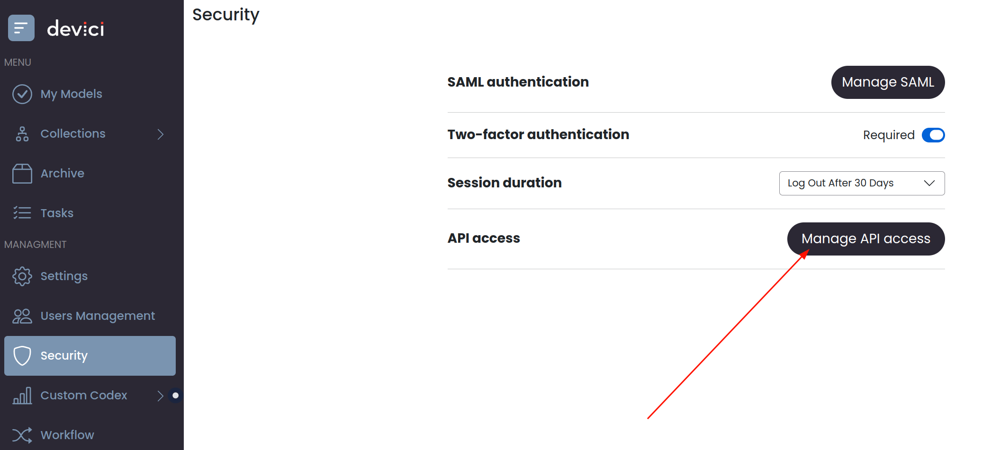

# Devici Code Genius Action
[](https://devici.com)
[](https://devici-code-genius-source.s3.us-east-2.amazonaws.com/v0.9.1/code-genius-v0.9.1.zip)

This GitHub Action runs [Devici Code Genius](https://devici.com/platform/code-genius) on your repository to generate a threat model.

## Getting Started

Use the following guide to set up Devici Code Genius with Repository Mode in GitHub Actions as a dedicated step in your pipeline: 

### How to add to your GitHub Actions pipeline

1. Get your API token to allow Code Genius to interact with Devici platform inside a pipeline runner. You can do this on:
**[Devici Admin](https://app.devici.com/admin/) page** > **API Access** > **Manage API Access**


2. Set up `CG_CLIENT_ID` and `CG_CLIENT_SECRET` secrets in GitHub repository/organization settings. [Learn how](https://docs.github.com/en/actions/security-for-github-actions/security-guides/using-secrets-in-github-actions).

3. _(Optional)_ Add `codegenius.yaml` file to your repository root for more fine-tuned detection (i.e. with some directories included/excluded). For example:

```yaml
   scenarios:
# Name of the thread model
- name: ThreatModelOne
  # Set true to include .gitignore content as ignore entities
  gitignore: false
  # Set relative paths to file or directories to be analyzed
  include:
    - # dir/path
  # Set relative paths to file or directories to exclude from analysis
  exclude:
    - # dir/path

```
- You can read more about codegenius.yaml [here](https://app.devici.com/code-genius#codegeniusyaml).


4. Create a file inside `.github/` directory in your repository root and put following example contents:

```yaml
# .github/code-genius.yaml

name: Run Devici Code Genius
on:
  # Choose between pull_request, push, fork etc. You can specify more than one scenario
  pull_request:
    # Choose between branches, tags.
    branches:
      # Set the desired branches or leave empty to run for every branch.
      - 'development', 'staging'
    
jobs:
    run:
      name: Run Test PR
      runs-on: ubuntu-latest
    
      steps:
        # Step 1. Checkout the code
        - name: Checkout Code
          uses: actions/checkout@v4

        # Step 2. Run Code Genius Repo mode provided that API token was set in secrets and the scanning directory is '.'
        - name: Run Code Genius
          uses: Devici-ThreatModel/code-genius-action@latest
          with:
            github-token: '${{ github.token }}'
```

- You are free to configure the pipeline however you like! You can get more info about setting up a GitHub Actions pipeline [here](https://docs.github.com/en/actions/writing-workflows/workflow-syntax-for-github-actions).


- _Sidenote_. When Code Genius is set up to run on a PR, it will generate helpful messages such as one below, as well as create a status badge before merging.


If you have any questions please visit [devici.com/code-genius](https://app.devici.com/code-genius) for more info about Devici Code Genius. 

_Happy threat-hunting_!

## Inputs

### `client-id`

Client ID for API access from the platform. This input is not required if provided inside Secrets.

### `client-secret`

Client Secret for API access from the platform. This input is required if provided inside Secrets.

### `path`

Path to the code to analyze. This input is not required. Default is `.`.

### `github-token`

GitHub Token. This input is required and the default value is '${{ github.token }}'.
